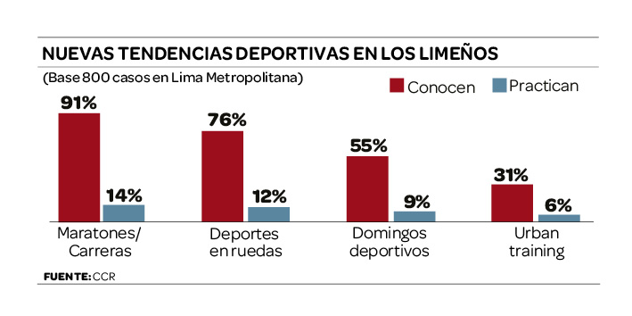
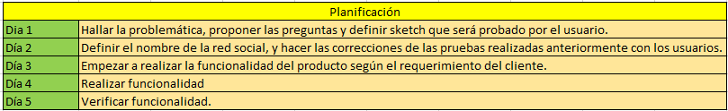
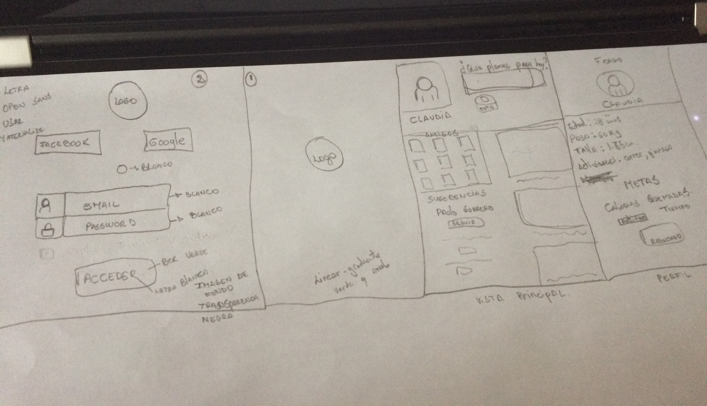
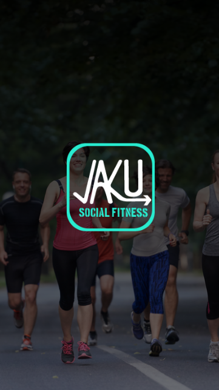
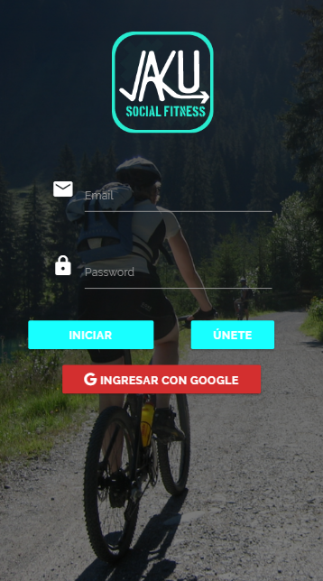
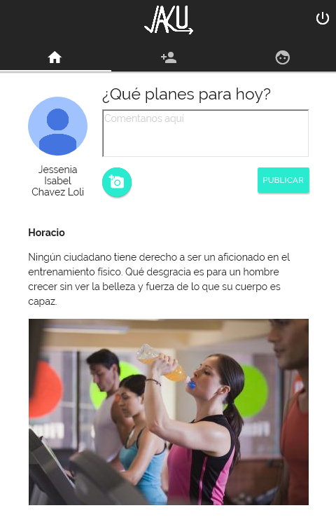
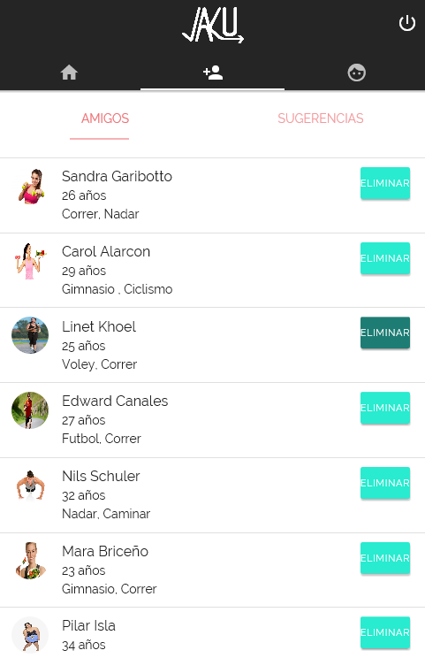
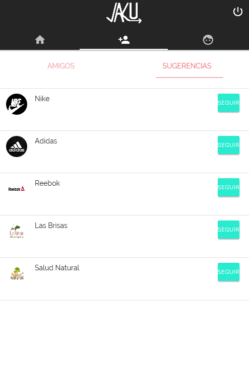
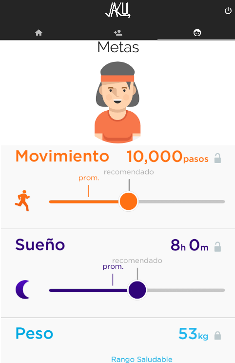

# Jaku: Social Fit

Jaku es una red social diseña para personas que esten interesadas en realizar deportes. No importa si recién estás empezando en el mundo del deporte, practicas fitness, running, culturismo, ciclismo o cualquier otro deporte, con Jaku tendrás la perfecta herramienta que te permitirá contactar con personas que tengan los mismo intereses que los tuyos. Puedes compartir tus ejercicios, rutinas, dietas, recetas y motivaciones, asimismo tambien podrás ver el día a día de tus amigos. Nosotros creemos que compartir conocimientos siempre suma.

## Desarrollado para
 [Laboratoria](http://laboratoria.la)

## Sobre el proyecto final

Nuestro cliente nos ha pedido desarrollar una red social que cumpla con los siguientes requisitos:

- Perfiles de usuarios
- Un newsfeed donde puedes ver las actualizaciones de todos tus contactos
- Un lugar donde poder escribir posts
- Un lugar para subir fotos
- Capacidad para poder tener amigos o para poder seguir a personas/marcas dentro de la red social
- Ser mobile friendly

### Qué se requiere?

- Trabajar en parejas
- Tener una planificación
- La definición del diseño
- Diseño mobile friendly
- Desplegar el producto en Github Pages
- Opcional, si se desarrolla un login o se desea almacenar la información en una base de datos, usar Firebase.

## LA PROBLEMÁTICA: Solo el 39% de peruanos realiza deporte

Al observar la data mostrada en la imagen, nos hicimos la siguiente pregunta: ¿Porqué motivo los peruanos no realizan ejercicio?. Luego de haber detectado la problemática, nos dimos cuenta que la mayoria indica que es por falta de tiempo, es por ello que nos vimos en la necesidad de crear una herramienta para tratar de solucionar dicho problema. Le hicimos preguntas a aquellos peruanos que indicaron no hacer ejercicio por falta de tiempo y se logró observar que muchos de ellos podrían hacer ejercicio por un periodo corto de tiempo al día si tuvieran a alguien con quien hacerlo, en ahí que interviene Jaku y actua como una red social de integración para todas aquellas personas que esten interesadas en hacer deporte.

# Desarrollo de la Red Social

### Nuestra Planificación

### Primer Scketch

- Al hacer las pruebas con las personas, pudimos notar que este primer sketch tenía la información muy cargada, por lo que decidimos realizar algunas modificaciones.

### Segundo Scketch

- Este es nuestro sketch final, en se basará el diseño de nuestra aplicación.

## Diseño de la aplicacion

### Vista Splash

Podemos visualizar nuestra vista vista pricipal.

### Vista Login

En esta vista nos aparacen las opciones para poder registrarnos, asimismo tambien nos permite acceder a través de una cuenta de google.

### Vista Principal

Esta es la vista principal en la cual se pueden realizar los post y subir las fotos.

### Vista Amigos

En esta vista podemos ver a todos los amigos que tenemos agregado, asimismo los podemos eliminar de nuestra lista.

### Vista Sugerencias

Esta vista nos ofrece sugerencias de personas o perosanjes publicos para seguir.

### Vista Sugerencias

En esta vista podemos apreciar nuestros objetivos.

### Integrantes

- Claudia Gariboto
- Isabel Chávez

